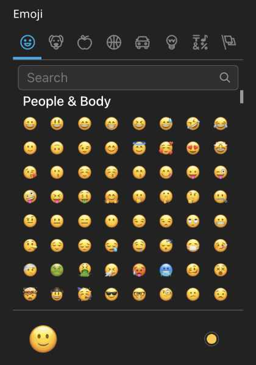

# JvMTECH.Emoji #
[](https://packagist.org/packages/jvmtech/emoji)
[](https://packagist.org/packages/jvmtech/emoji)

Emoji inspector editor for Neos CMS using [emoji-mart](https://www.npmjs.com/package/emoji-mart).



## Installation
```
composer require jvmtech/emoji
```

## Usage

### NodeType

It is important to use type array for your property.

```
properties:
  emoji:
    type: array
    ui:
      label: 'Emoji'
      inspector:
        editor: 'JvMTECH.Emoji/EmojiEditor'
```

### Fusion

In your fusion prototype, the emoji can be output as follows:

```
prototype(Your.Package:Emoji) < prototype(Neos.Fusion:Component) {
    emoji = ${q(node).property('emoji')}
    renderer = afx`<div @if.has={props.emoji}>{props.emoji.native}</div>`
}
```

The following object keys are available:

```
{
  id: 'smiley',
  name: 'Smiling Face with Open Mouth',
  colons: ':smiley:',
  text: ':)',
  emoticons: [
    '=)',
    '=-)'
  ],
  skin: null,
  native: '😃'
}
```
